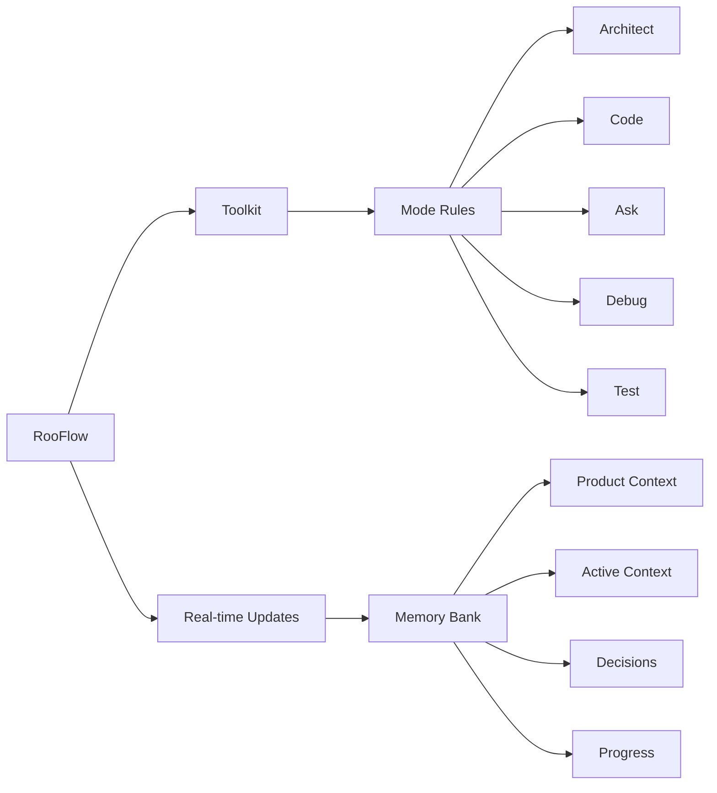

### Fork information:

This is a fork of [RooFlow](https://github.com/GreatScottyMac/RooFlow), this fork aims to be more generic, without specifying system informations. So that it could be used in collaborated projects (OSS).

This fork could also contains opinionated modifications/optimizations over RooFlow, so take that in mind.

#### Current notable changes (vs `v0.3.5`):
  + Documents heavily revised.
  + Restructures: 
    + `config` is now `src`.
    + Custom RooFlow modes are now defined in `.roocodes`
      + This is more intuitive:
        + Better DX/UX (Users simply open the project and proceed)
        + Adding RooFlow modes as `global` scope is not gonna work anyways, as custom system prompt files are needed.

---

<div align="center">

#### Now with install scripts for [Windows](./src/install_rooflow.cmd) and [Linux/macOS](./src/install_rooflow.sh)!

#### [Default Mode](#install-global-default-and-boomerang-modes) and [Boomerang Mode](#install-global-default-and-boomerang-modes) are available for manual installation.

##### For MCP server use in RooFlow custom modes, there is a `MCP_SERVERS_PLACEHOLDER` in the `system-prompt-[mode]` files where connected MCP servers will need to be inserted.

<br>

### ☢️☢️☢️ Footgun in Use ☢️☢️☢️

<br>

# RooFlow *generic*


**Persistent Project Context and Streamlined AI-Assisted Development for [Roo Code](https://github.com/RooVetGit/Roo-Code)**

</div>

## 🎯 Overview

RooFlow enhances AI-assisted development in VS Code by providing **persistent project context** and **optimized mode interactions**, resulting in **reduced token consumption** and a more efficient workflow. It builds upon the concepts of the Roo Code Memory Bank, but streamlines the process and introduces a more integrated system of modes. RooFlow ensures your AI assistant maintains a deep understanding of your project across sessions, even after interruptions.

### Key Improvements over Roo Code Memory Bank:

* **Reduced Token Consumption:** Optimized prompts and instructions minimize token usage.
* **Five Integrated Modes:** Architect, Code, Test, Debug, and Ask modes work together seamlessly.
* **Simplified Setup:** Easier installation and configuration.
* **Streamlined Real-time Updates:** More efficient and targeted Memory Bank updates.
* **Clearer Instructions:** Improved YAML-based rule files for better readability and maintainability.

### Key Components



- 🧠 **Memory Bank**: Persistent storage for project knowledge (automatically managed).
- 💻 **System Prompts**: YAML-based core instructions for each mode (`.roo/system-prompt-[mode]`).
- 🔧 **VS Code Integration**: Seamless development experience within VS Code.
- ⚡ **Real-time Updates**: Automatic Memory Bank updates triggered by significant events.

## 🚀 Quick Start

### Installation

1. **Install Roo Code Extension:** Ensure you have the [Roo Code extension](https://github.com/RooVetGit/Roo-Code) installed in VS Code.
2. **Prerequisite: Install Git:** The installation script requires `git` to be installed and accessible in your system's PATH. Download Git from [https://git-scm.com/downloads](https://git-scm.com/downloads).
3. **Open your terminal** and navigate (`cd`) to your project's **root directory**.
4. **Download the appropriate script** for your operating system:
  * **Windows (Command Prompt or PowerShell):**
  ```cmd
  curl -L -o install_rooflow.cmd https://raw.githubusercontent.com/NamesMT/RooFlow-generic/main/src/install_rooflow.cmd
  ```
  * **Linux / macOS (bash/zsh):**
  ```sh
  curl -Lo install_rooflow.sh https://raw.githubusercontent.com/NamesMT/RooFlow-generic/main/src/install_rooflow.sh
  ```
5. **Run the downloaded script:**
  * **Windows:**
  ```cmd
  .\install_rooflow.cmd
  ```
  * **Linux / macOS:**
  ```bash
  chmod +x install_rooflow.sh
  ./install_rooflow.sh
  ```
6. The script will check for `git`, clone the repository, move files, clean up, and run `insert-variables.sh`. Follow any on-screen prompts or error messages.
7. **Note:** Upon successful completion, `install_rooflow.sh` and `insert-variables.sh` will be automatically removed.
8. **Verify Installation:** After the script runs successfully:
  * Check that the `.roo/` directory, along with the `.roomodes` file exist in your project root.

### Using RooFlow

1. **Start a Chat:** Open a new Roo Code chat in your project.
2. **Select a Mode:** Choose the appropriate mode (Architect, Code, Test, Debug, Ask, Default or Boomerang) for your task.
  *. Generally, you should start with the Default mode, which is designed for general project context and collaboration.
  *. If you are doing a large and long task, use Boomerang mode.
3. **Interact with Roo:**  Give Roo instructions and ask questions. Roo will automatically use the Memory Bank to maintain context.

#### Notes:
1. **Memory Bank Initialization:**  If you start a chat in a project *without* a `memory-bank/` directory, Roo will suggest switching to Architect mode and guide you through the initialization process.
2. **"Update Memory Bank" Command:** At any time, you can type "Update Memory Bank" or "UMB" to force a synchronization of the chat session's information into the Memory Bank. This is useful for ensuring continuity across sessions or before switching modes.

## 📚 Memory Bank Structure

The Memory Bank is a directory, located at `memory-bank/` relative to your project's root. It contains several Markdown files that store different aspects of your project's knowledge:

| File                | Purpose                                                                                                                                |
| ------------------- | -------------------------------------------------------------------------------------------------------------------------------------- |
| `activeContext.md`  | Tracks the current session's context: recent changes, current goals, and open questions/issues.                                        |
| `decisionLog.md`    | Records architectural and implementation decisions, including the context, decision, rationale, and implementation details.            |
| `productContext.md` | Provides a high-level overview of the project, including its goals, features, and overall architecture.                                |
| `progress.md`       | Tracks the progress of the project, including completed work, current tasks, and next steps.  Uses a task list format.                 |
| `systemPatterns.md` | (Optional) Documents recurring patterns and standards used in the project (coding patterns, architectural patterns, testing patterns). |

RooFlow automatically manages these files. You generally don't need to edit them directly, although you can review them to understand the AI's knowledge.

## ✨ Features

### 🧠 Persistent Context

The Memory Bank ensures that RooFlow retains project knowledge across sessions. When you start a new chat, RooFlow reads the Memory Bank files, providing the AI with immediate context.

### ⚡ Real-time Updates

RooFlow automatically updates the Memory Bank during your chat session when significant changes occur (e.g., new decisions, code modifications, task completion). This keeps the context fresh and accurate. The "Update Memory Bank" (UMB) command allows for manual synchronization.

### 🤝 Mode Collaboration

The different modes (Architect, Code, Test, Debug, Ask) are designed to collaborate. Each mode has specific triggers and handoff points defined in its system prompt, allowing for seamless transitions between specialized tasks.

### ⬇️ Reduced Token Consumption

By storing persistent context in the Memory Bank and using optimized prompts, RooFlow significantly reduces the number of tokens needed for each interaction compared to traditional methods that rely solely on chat history.

## ⚙️ Configuration

* **System Prompts (`.roo/system-prompt-[mode]`):** Customize the core behavior of each mode.
* **Mode Definitions (`.roomodes`):** Define custom modes and their associated system prompts.

## Contributing

See [CONTRIBUTING.md](./CONTRIBUTING.md) for details on how to contribute to RooFlow.

## License

[Apache 2.0](./LICENSE)
